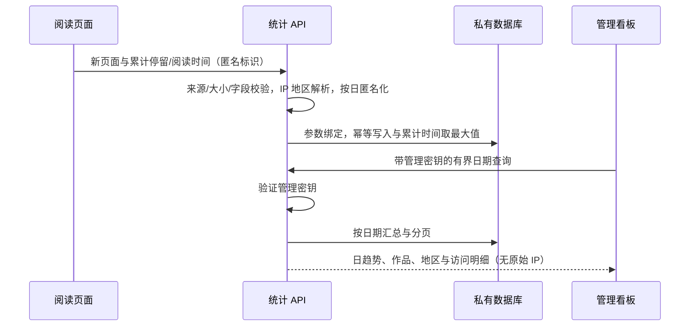

# 慢页访问与阅读统计

创建者：Codex；创建日期：2026/09/28。

## 边界与影响

现有网页继续静态部署在 GitHub Pages。新增独立统计 API 与数据库；不将统计明细提交到 GitHub。
不读取旧阅读书签、摘句或私人录音。前端配置只有公开服务地址，不包含管理密钥。
服务未配置时不创建访客标识、不发请求；file:// 本地打开不计入线上流量。
后台页面需要管理密钥才能读取数据。管理密钥仅放在服务端 secret 与当前后台页面内存中。

## 统计口径

- 时间：按 Asia/Shanghai（UTC+8）分日；访问开始时间采用服务端首次接收时间。
- 浏览量 PV：一个页面实例每天一条记录，刷新是新实例；重复上报更新累计时间，不重复增加 PV。
- 日访客 UV：当天随机浏览器标识去重，经服务端按日 HMAC 后存储；不是精确的自然人数。
  不跨日关联；隐私模式、清除存储或换浏览器会增加计数，共用浏览器会减少计数。
- 页面停留：页面可见且窗口有焦点的累计时间，后台标签、熄屏不计。
- 有效阅读：页面可见且有焦点，正文出现在视口，最近 60 秒有交互的时间估计。
  无交互的长时间挂机不计，静止精读超过 60 秒可能少计；这不是眼动或真实理解程度。
- 动态观看：在前台且动态播放器正在播放时累计，单独展示，不冒充正文阅读。
- 平均停留：所选日期范围内页面停留总秒数 / 页面浏览量，包含零秒访问。
- 平均阅读：阅读总秒数 / 阅读秒数大于零的页面记录数；分母明确显示。
- 每部作品：统计全文页的浏览、访客日、阅读时长；书评和动态页独立列出。
- 地区：在接收端根据请求 IP 的地区元数据解析国家、省/州与城市，不向浏览器请求地理定位。
  不保存原始 IP；代理、VPN、运营商出口或数据库缺失会使城市不准或未知。
- 时间范围访客：使用“访客日”标签，跨天日 UV 相加，不称为整段时间去重人数。
- 从启用以后开始统计，不能还原以前 GitHub Pages 的完整访问历史。

## 数据结构与接口评审

新增单表 visit；主键是随机页面 ID。每次上报累计毫秒数，以 MAX 更新，容忍重发与乱序。
访问路径只接受本站白名单，作品 ID 从路径映射，不信任客户端标题、地区或 SQL 条件。
不采集 URL 查询字符串、表单内容、录音文件名、书签内容或设备指纹。
明细默认保留 90 天；不保留过期 IP 或标识。删除仅由定时维护按过期边界执行。
统计按日期与路径索引查询，日期范围最大 31 天，明细分页每页 50 条。

接口：HTTPS POST /events（单条 JSON，最大 2 KB）；GET /stats?from=yyyy-MM-dd&to=yyyy-MM-dd&page=1。
统计接口使用 Authorization: Bearer 管理密钥，响应 Cache-Control: no-store。
错误响应含 errorCode、errorMessage、message；不暴露 SQL、IP、密钥或原始异常。
使用严格 CORS 来源白名单，不开启凭证 Cookie；管理认证不依赖 Cookie，因此没有 Cookie CSRF。
公开采集接口要限流；来源校验只能约束浏览器，不能作为“防伪造”的保证。

## 数据流

## 运行与成本

推荐 Cloudflare Workers + D1，但需要用户账号授权和实际部署地址后才能启用。
按 30 秒上报一次有变化的累计数据；退出时补报，失败不影响阅读。
免费额度不是无限额度：Workers 请求与 D1 读写都有日限额，心跳也消耗请求与写入。
服务端限流与输入上限不能阻止所有刷量；浏览器拦截、断网和退出时丢包会少计。
分析只用于了解阅读趋势，不能作为账单、考勤或精确在线人数依据。

参考：
- https://developers.cloudflare.com/workers/runtime-apis/request/
- https://developers.cloudflare.com/workers/platform/pricing/
- https://developers.cloudflare.com/d1/platform/pricing/
